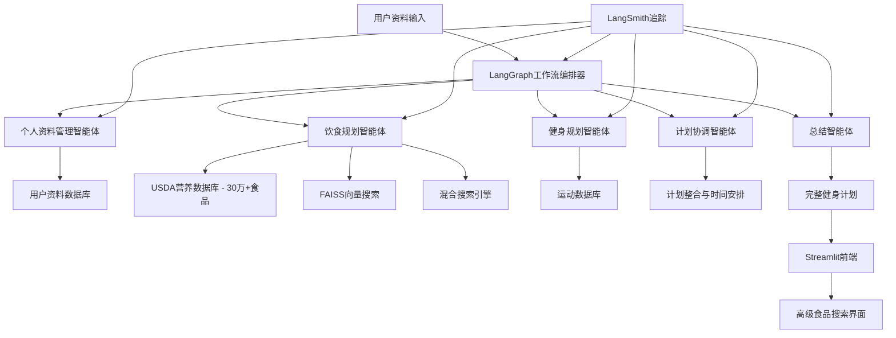

# AI 健身规划师 🏋️‍♂️


基于LangGraph工作流的全栈GenAI系统，使用真实的USDA营养数据和协调的AI智能体创建个性化的健身和营养计划。

**功能介绍**：上传您的个人资料，几分钟内即可获得完整的饮食和健身计划。就像拥有一个由AI驱动的私人教练和营养师。

---

## 🚀 快速开始（5分钟）

**前置要求**：Docker 和 Git

```bash
# 1. 克隆并设置项目
git clone https://github.com/zen-apps/ai-fitness-planner.git
cd ai-fitness-planner
cp .env.example .env

# 2. 配置阿里云API密钥
# 编辑 .env 文件，设置 TONGYI_API_KEY 和 DASHSCOPE_API_KEY
# 详细配置说明请参考 README_ALIYUN.md

# 3. 启动所有服务（自动下载营养数据）
make setup-demo
```

**完成！** 访问您的应用：
- **前端界面**：http://localhost:8501
- **API文档**：http://localhost:8000/docs
- **MongoDB管理界面**：http://localhost:8081

---

## 🎯 核心功能

### ✅ **个性化计划**
- 根据您的目标定制热量和宏量营养素目标
- 使用真实USDA食品数据生成AI饮食计划
- 根据您的设备和经验定制健身计划

### ✅ **智能食品搜索**
- 语义搜索："高蛋白早餐食品"
- 5000种精选食品，涵盖所有主要类别
- 饮食限制过滤（素食、无麸质等）

### ✅ **LangGraph AI工作流**
- 多个AI智能体协同工作
- 个人资料管理 → 饮食规划 → 健身规划 → 协调整合
- 实时计划生成，完整可追溯性

---

## 🛠️ 系统架构

### **多智能体系统**



### **技术栈**
- **LangGraph**：AI工作流编排
- **阿里云通义千问**：快速、经济高效的推理引擎
- **LangSmith**：AI工作流的可观测性和追踪
- **FAISS**：营养数据的向量搜索
- **MongoDB**：5000种精选USDA食品
- **PostgreSQL**：用户数据和计划存储
- **Streamlit**：交互式前端
- **FastAPI**：生产级API后端

---

## 💡 核心特性

### **智能营养数据库**
- 从45万+ USDA数据库中智能采样的5000种食品
- 增强的每100克营养成分计算
- 宏量营养素分解分析（高蛋白/脂肪/碳水化合物分类）
- 亚秒级语义搜索

### **协调规划**
- 围绕训练优化饮食时间安排
- 训练前/后营养建议
- 训练日与休息日饮食变化
- 目标特定计划（增肌/减脂/维持）

### **生产就绪**
- Docker容器化
- 自动化数据库设置
- LangSmith可观测性集成
- 全面的错误处理

---

## 🔧 开发指南

```bash
# 查看日志
make logs

# 查看后端日志
make logs-be

# 查看前端日志
make logs-fe

# 重置数据库
make clean-db

# 测试系统
curl http://localhost:8000/docs
```

### **环境配置**
编辑 `.env` 文件，设置您的API密钥：
```bash
# 阿里云API密钥（必需）
TONGYI_API_KEY=sk-your_aliyun_tongyi_api_key_here
DASHSCOPE_API_KEY=sk-your_aliyun_tongyi_api_key_here

# LangSmith API密钥（可选）
LANGSMITH_API_KEY=lsv2_your_langsmith_api_key_here

# 数据库配置
DB_USER=groot
DB_PASSWORD=1245
DB_NAME=ai_fitness_planner

# MongoDB配置
MONGO_USER=groot
MONGO_PASSWORD=1245
MONGO_DB_NAME=usda_nutrition
```

详细配置说明请参考 [README_ALIYUN.md](README_ALIYUN.md)

---

## 🎨 项目特色

### **LangGraph工作流**
与单一LLM调用不同，本系统使用编排的AI智能体：
- 共享上下文并协调决策
- 处理复杂的多步骤推理
- 提供透明的执行追踪
- 可扩展到更复杂的场景

### **真实数据集成**
- 实际USDA营养数据库（非模拟数据）
- 向量嵌入实现语义食品匹配
- 生产级数据处理流水线

### **生产模式**
- 使用LangSmith追踪可观测
- Docker可扩展架构
- 完整的错误处理机制

---

## 🚀 扩展功能

想要扩展本项目？可以轻松添加：
- **进度追踪智能体**：监控用户改进情况
- **补剂建议**：根据饮食差距推荐补剂
- **可穿戴设备集成**：连接健身追踪器
- **移动应用**：React Native前端

---

## 📈 为什么选择LangGraph？

传统LLM只给您一个响应。LangGraph提供：
- **协调智能**：多个专家协同工作
- **状态管理**：智能体共享并基于彼此的工作构建
- **可靠性**：内置错误处理和重试机制
- **透明度**：清晰了解决策过程

非常适合复杂的多步骤AI应用，如健身规划。

---

## 📚 相关文档

- [阿里云API使用指南](README_ALIYUN.md) - 详细的API配置和模型选择说明
- [贡献指南](CONTRIBUTING.md) - 如何参与项目开发

---

**准备构建您自己的AI健身教练？** 克隆项目，运行 `make setup-demo`，几分钟内开始生成个性化计划！ 💪